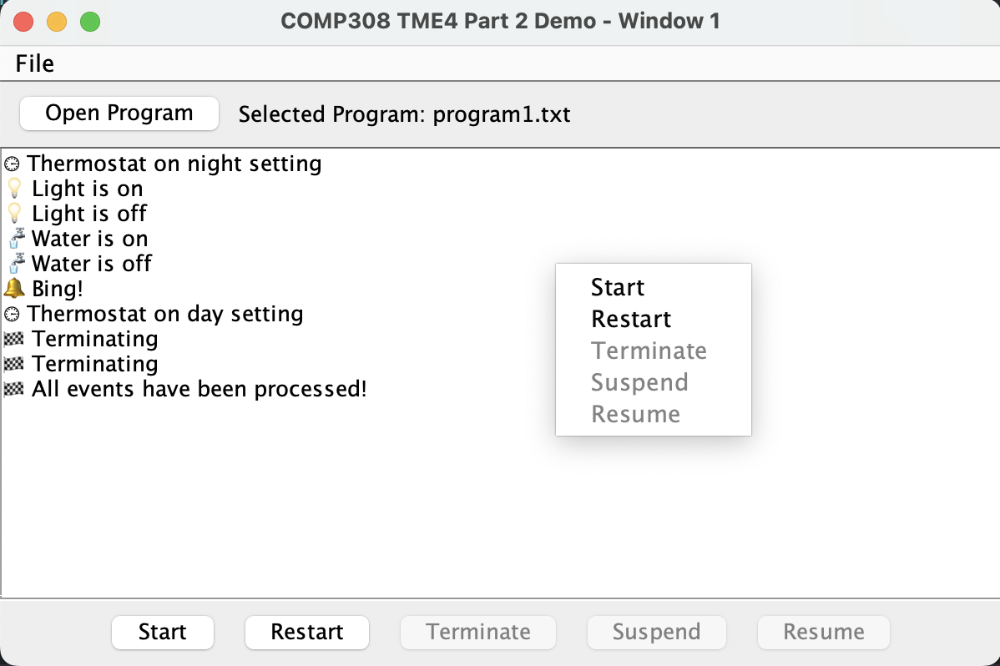
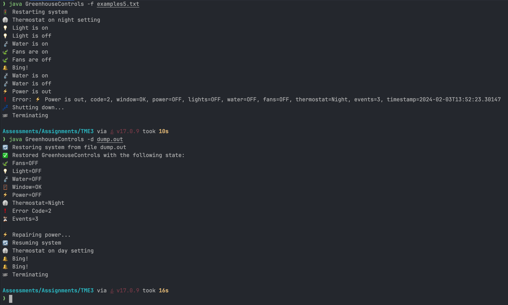

# TME4: Greenhouse Controls




The Greenhouse Controls program simulates a greenhouse with various sensors and controls. The program is designed to be flexible and can be configured to run different scenarios by providing a configuration file.

## How to Run

These programs are written and tested against JDK17 on a macOS.

To compile the code, run:

```bash
javac **/*.java
```

To execute the code, run `java` with the appropriate filename.

### GUI

To run the GUI:

```bash
java GreenhouseControls
```

## Error Logs

All errors encountered during execution are logged in the `error.log` file.

After encountering an error, the program will store the current state of the program in `dump.out` and terminate.

Sample error logs:

```text
Error: ⚡️ Power is out, code=2, window=OK, power=OFF, lights=OFF, water=OFF, fans=OFF, thermostat=Night, events=3, timestamp=2024-02-03T13:52:23.30147
Error: 🪟 Window malfunction, code=1, window=BROKEN, power=ON, lights=OFF, water=OFF, fans=OFF, thermostat=Day, events=2, timestamp=2024-02-03T14:03:12.992468
Error: ⚡️ Power is out, code=2, window=OK, power=OFF, lights=OFF, water=OFF, fans=OFF, thermostat=Night, events=3, timestamp=2024-02-03T14:04:20.857673
Error: ⚡️ Power is out, code=2, window=OK, power=OFF, lights=OFF, water=OFF, fans=OFF, thermostat=Night, events=3, timestamp=2024-02-03T14:05:21.061923text
```

### Restoring After Error

To restore the program after an error, run the program with the `-d` flag and the filename of the dump file.

```bash
java GreenhouseControls -d dump.out
```

```text
🔄 Restoring system from file dump.out
✅ Restored GreenhouseControls with the following state:
🍃 Fans=OFF
💡 Light=OFF
🚰 Water=OFF
🪟 Window=OK
⚡️ Power=OFF
⏲️ Thermostat=Night
❗️ Error Code=2
⏳ Events=3

⚡️ Repairing power...
🔄 Resuming system

⏲️ Thermostat on day setting
🔔 Bing!
🔔 Bing!
🏁 Terminating
```

## Sample Outputs

### Example 1:

```bash
java GreenhouseControls -f examples1.txt
```

```text
🚦 Restarting system
⏲️ Thermostat on night setting
💡 Light is on
💡 Light is off
🚰 Water is on
🚰 Water is off
🔔 Bing!
⏲️ Thermostat on day setting
🏁 Terminating
```

### Example 2:

```bash
java GreenhouseControls -f examples2.txt
```

```text
🚦 Restarting system
⏲️ Thermostat on night setting
💡 Light is on
💡 Light is off
🚰 Water is on
🍃 Fans are on
🍃 Fans are off
🔔 Bing!
🚰 Water is off
⏲️ Thermostat on day setting
🔔 Bing!
🏁 Terminating
```

### Example 3:

```bash
java GreenhouseControls -f examples3.txt
```

```text
🚦 Restarting system
⏲️ Thermostat on night setting
💡 Light is on
💡 Light is off
🚰 Water is on
🍃 Fans are on
🍃 Fans are off
🔔 Bing!
🚰 Water is off
⏲️ Thermostat on day setting
🪟 Window malfunction
❗️ Error: 🪟 Window malfunction, code=1, window=BROKEN, power=ON, lights=OFF, water=OFF, fans=OFF, thermostat=Day, events=2, timestamp=2024-02-03T14:03:12.992468
💤 Shutting down...
🏁 Terminating
```

#### Restoring:

```bash
java GreenhouseControls -d dump.out
```

```text
🔄 Restoring system from file dump.out
✅ Restored GreenhouseControls with the following state:
🍃 Fans=OFF
💡 Light=OFF
🚰 Water=OFF
🪟 Window=BROKEN
⚡️ Power=ON
⏲️ Thermostat=Day
❗️ Error Code=1
⏳ Events=2

🪟 Repairing window...
🔄 Resuming system

🔔 Bing!
🏁 Terminating
```

### Example 4:

```bash
java GreenhouseControls -f examples4.txt
```

```text
🚦 Restarting system
⏲️ Thermostat on night setting
💡 Light is on
💡 Light is off
🚰 Water is on
🍃 Fans are on
🍃 Fans are off
🔔 Bing!
🚰 Water is off
⚡️ Power is out
❗️ Error: ⚡️ Power is out, code=2, window=OK, power=OFF, lights=OFF, water=OFF, fans=OFF, thermostat=Night, events=3, timestamp=2024-02-03T14:04:20.857673
💤 Shutting down...
🏁 Terminating
```

#### Restoring:

```bash
java GreenhouseControls -d dump.out
```

```text
🔄 Restoring system from file dump.out
✅ Restored GreenhouseControls with the following state:
🍃 Fans=OFF
💡 Light=OFF
🚰 Water=OFF
🪟 Window=OK
⚡️ Power=OFF
⏲️ Thermostat=Night
❗️ Error Code=2
⏳ Events=3

⚡️ Repairing power...
🔄 Resuming system

⏲️ Thermostat on day setting
🔔 Bing!
🏁 Terminating
```

### Example 5:

```bash
java GreenhouseControls -f examples5.txt
```

```text
🚦 Restarting system
⏲️ Thermostat on night setting
💡 Light is on
💡 Light is off
🚰 Water is on
🍃 Fans are on
🍃 Fans are off
🔔 Bing!
🚰 Water is on
🚰 Water is off
⚡️ Power is out
❗️ Error: ⚡️ Power is out, code=2, window=OK, power=OFF, lights=OFF, water=OFF, fans=OFF, thermostat=Night, events=3, timestamp=2024-02-03T14:05:21.061923
💤 Shutting down...
🏁 Terminating
```

#### Restoring:

```bash
java GreenhouseControls -d dump.out
```

```text
🔄 Restoring system from file dump.out
✅ Restored GreenhouseControls with the following state:
🍃 Fans=OFF
💡 Light=OFF
🚰 Water=OFF
🪟 Window=OK
⚡️ Power=OFF
⏲️ Thermostat=Night
❗️ Error Code=2
⏳ Events=3

⚡️ Repairing power...
🔄 Resuming system

⏲️ Thermostat on day setting
🔔 Bing!
🏁 Terminating
```
